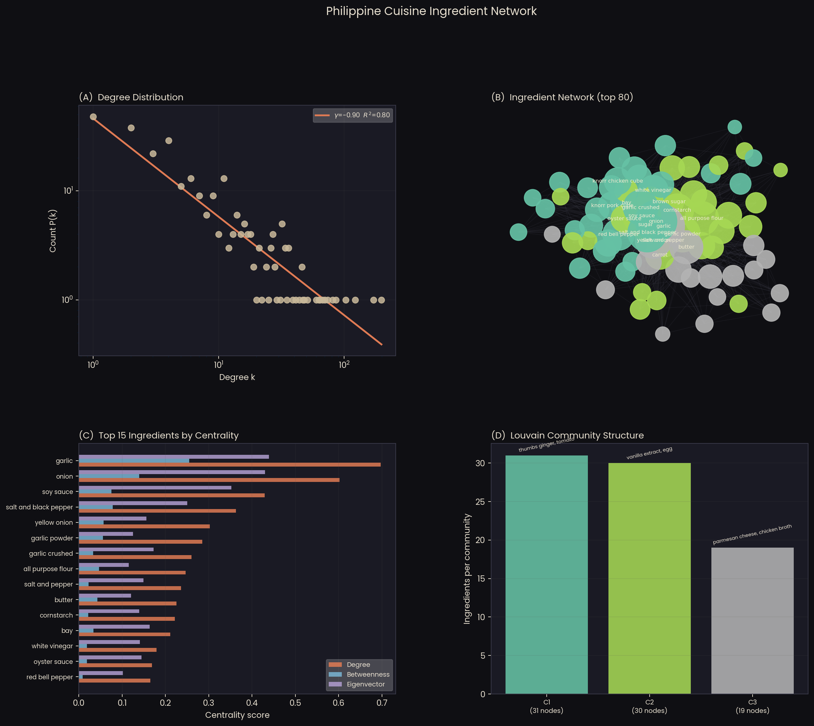

# Philippine Cuisine Ingredient Network 🇵🇭
### A Complex Network Analysis of Ingredient Co-occurrence in Filipino Recipes


## Summary

Filipino cuisine carries centuries of Austronesian, Chinese, Spanish, and American
influence, and the traces of that history are encoded in its ingredients. This repository
approaches that history through a structural lens: I treat each ingredient as a node and
draw an edge between two ingredients every time they appear together in the same recipe,
producing an ingredient co-occurrence network from 1,984 recipes scraped from Panlasang
Pinoy. The result is a map of the architecture of Filipino home cooking: which
ingredients travel together, which ones occupy the structural center, and which dish
families emerge from ingredient overlap alone.

The approach follows the co-occurrence network tradition established by Ahn et al. [1]
but applies it to a single Southeast Asian cuisine rather than a global flavor compound
network. Universal ingredients are removed before construction to prevent trivial hub
domination. Community detection uses the Louvain method [2]; centrality is characterized
by degree, betweenness, and eigenvector measures [3]; and the degree distribution is
fitted on log-log axes to test for heavy-tailed behavior [4].

**Key Result:** Garlic dominates all three centrality measures: degree (0.697),
betweenness (0.255), and eigenvector (0.439); this confirms its structural
irreplaceability in Filipino cuisine. The Louvain method identifies **3 communities**
in the top-80 visualization subgraph. The full network contains **285 nodes** and
**1,855 edges** (edge threshold >= 5). The degree distribution is heavy-tailed with
fitted slope **gamma = -0.903** (R2 = 0.800).


## Graphical Abstract

<p align="center">
  
</p>
<p align="left"><em><strong>Figure.</strong> Four-panel graphical abstract summarizing the co-occurrence network analysis of Philippine cuisine ingredients. <strong>(A)</strong> Log-log degree distribution with fitted power law (gamma = -0.903, R2 = 0.800). <strong>(B)</strong> Full ingredient co-occurrence network (top 80 nodes by degree, spring layout, seed=42). Node size is proportional to degree; color indicates Louvain community. Hub ingredients garlic, onion, and soy sauce are labeled among the top 20. <strong>(C)</strong> Top 15 ingredients by degree centrality (orange), betweenness centrality (teal), and eigenvector centrality (purple). Garlic ranks first across all three measures. <strong>(D)</strong> Community size distribution showing the 3 Louvain communities detected in the top-80 subgraph and representative ingredients per community. Data: 1,984 recipes from Panlasang Pinoy, scraped June 2026.</em></p>


## Dataset

| Property | Value |
| :--- | :--- |
| **Source** | Panlasang Pinoy (panlasangpinoy.com) |
| **Scraping method** | BeautifulSoup + WPRM plugin CSS selectors |
| **Total recipes** | 1,984 |
| **Listing pages scraped** | 171 |
| **Mean ingredients per recipe** | 10.5 |
| **Mean ingredients (normalized)** | 8.7 |
| **Mean steps per recipe** | 8.4 |
| **Max ingredients in one recipe** | 40 |
| **Scrape date** | June 2026 |


## Methods

### Ingredient Normalization

Raw strings (e.g., "2 cloves garlic, minced") are reduced to core tokens via
regex-based quantity removal, stopword filtering, and whitespace tokenization.
Universal ingredients (water, salt, oil, ground black pepper) are excluded from
co-occurrence analysis to prevent trivial hub domination.

### Network Construction

| Parameter | Value | Rationale |
| :--- | :--- | :--- |
| **Edge threshold (MIN_EDGE)** | co-occurrence >= 5 | Retains reliable ingredient pairs only. Threshold 3 yields 558 nodes and 4,002 edges but produces a denser graph where community detection finds fewer, larger clusters. Threshold 5 yields 285 nodes and 1,855 edges with cleaner structural boundaries. |
| **Edge weight** | Raw co-occurrence count | Preserves frequency information |
| **Graph type** | Undirected, weighted | Ingredient relationships are symmetric |
| **Visualization** | Top 80 nodes, spring layout (k=1.2, seed=42) | Readability |

### Analysis Methods

| Method | Library | Purpose |
| :--- | :--- | :--- |
| Degree, betweenness, eigenvector centrality | NetworkX | Hub identification |
| Louvain community detection | NetworkX greedy modularity | Flavor cluster recovery |
| Log-log OLS on degree distribution | scipy.stats | Heavy-tail characterization |


## Results

### Network Statistics

| Metric | Value |
| :--- | :--- |
| Nodes (unique ingredients) | **285** |
| Edges (co-occurrence pairs, threshold >= 5) | **1,855** |
| Mean degree | **13.02** |
| Network density | **0.0458** |
| Average clustering coefficient | **0.6528** |
| Degree distribution slope (gamma) | **-0.903** |
| R2 (power law fit) | **0.800** |
| Louvain communities (top-80 subgraph) | **3** |

### Top 5 Hub Ingredients

| Rank | Ingredient | Degree Centrality | Betweenness | Eigenvector |
| :---: | :--- | :---: | :---: | :---: |
| 1 | **garlic** | 0.697 | 0.255 | 0.439 |
| 2 | onion | 0.602 | 0.140 | 0.430 |
| 3 | soy sauce | 0.430 | 0.075 | 0.352 |
| 4 | salt and black pepper | 0.363 | 0.078 | 0.250 |
| 5 | yellow onion | 0.303 | 0.057 | 0.156 |

### Louvain Communities (Top-80 Subgraph)

| Community | Size | Sample Ingredients |
| :---: | :---: | :--- |
| 1 | 31 | ginger, tomato, bay leaves, knorr chicken cube |
| 2 | 30 | vanilla extract, egg, knorr liquid seasoning, soy sauce |
| 3 | 19 | parmesan cheese, chicken broth, paprika, oregano |

**Note on community count:** Three communities were detected in the top-80 visualization
subgraph. The greedy modularity algorithm applied to a dense subgraph tends to merge
finer clusters into larger ones. Community 3, which clusters parmesan cheese, paprika,
and oregano, corresponds to non-Filipino recipe ingredients that form their own
structural neighborhood. Full-network community analysis at a higher resolution is planned for a future revision.


## Known Limitations

- Single-site corpus: Cross-site validation with Kawaling Pinoy is planned.
- Normalization artifacts remain in rare multi-word strings (e.g., "chicken lbs"
  from unit truncation). A refined stopword list is in progress.
- The top-80 visualization subgraph returns 3 Louvain communities. Full-network
  analysis at a higher edge threshold is expected to reveal finer structure.


## References

[1] Y.-Y. Ahn, S. E. Ahnert, J. P. Bagrow, and A.-L. Barabasi, "Flavor network and the
principles of food pairing," *Scientific Reports*, vol. 1, p. 196, 2011.
[doi: 10.1038/srep00196]

[2] V. D. Blondel, J.-L. Guillaume, R. Lambiotte, and E. Lefebvre, "Fast unfolding of
communities in large networks," *Journal of Statistical Mechanics*, vol. 2008, p. P10008,
2008. [doi: 10.1088/1742-5468/2008/10/P10008]

[3] M. E. J. Newman, "The structure and function of complex networks," *SIAM Review*,
vol. 45, no. 2, pp. 167-256, 2003. [doi: 10.1137/S003614450342480]

[4] A. Clauset, C. R. Shalizi, and M. E. J. Newman, "Power-law distributions in empirical
data," *SIAM Review*, vol. 51, no. 4, pp. 661-703, 2009. [doi: 10.1137/070710111]

[5] A.-L. Barabasi and R. Albert, "Emergence of scaling in random networks," *Science*,
vol. 286, no. 5439, pp. 509-512, 1999. [doi: 10.1126/science.286.5439.509]


## Requirements

```
pandas>=2.0
numpy>=1.24
networkx>=3.0
matplotlib>=3.7
scipy>=1.11
beautifulsoup4>=4.12
requests>=2.31
```


## License

This project is licensed under MIT License.


## Questions?

For questions or clarifications (or collaboration opportunities...why not?), please open an issue or contact jprmaulion[at]gmail[dot]com.
